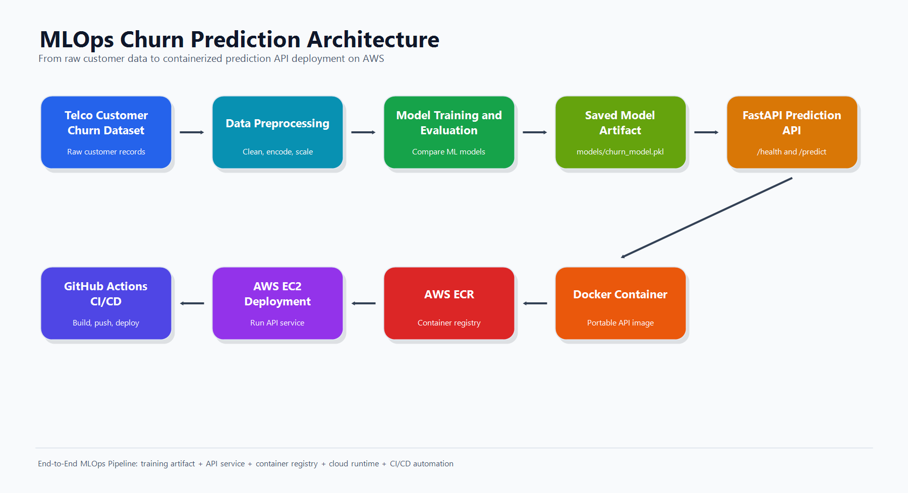
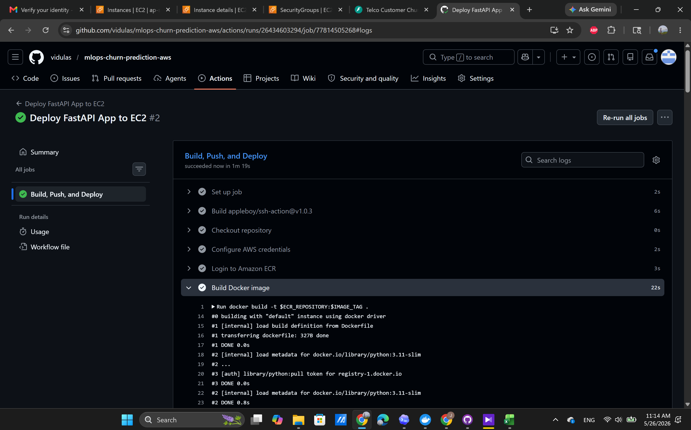

# End-to-End MLOps Pipeline for Customer Churn Prediction on AWS

This repository demonstrates a complete, portfolio-ready MLOps workflow for customer churn prediction. It covers model training, model comparison, API serving, Docker containerization, AWS deployment, and manual CI/CD deployment with GitHub Actions.

The final system serves a trained Telco churn prediction model through a FastAPI REST API. The application is packaged as a Docker image, pushed to Amazon ECR, deployed on an Amazon Linux 2023 EC2 instance, and exposed on port `8000`.

## Project Overview

Customer churn prediction helps subscription-based businesses identify customers who are likely to cancel their service. This project builds an end-to-end machine learning service that predicts churn risk from customer demographic, billing, account, and service usage features.

Completed project scope:

- Trained churn prediction models using the Telco Customer Churn dataset
- Compared Logistic Regression and Random Forest classifiers
- Selected Logistic Regression as the final model based on F1-score and ROC-AUC
- Saved the trained model artifact as `models/churn_model.pkl`
- Built a FastAPI API with `/health` and `/predict` endpoints
- Containerized the API with Docker
- Tested the API locally and inside Docker
- Created an Amazon ECR repository named `telco-churn-api`
- Pushed the Docker image to Amazon ECR
- Deployed the containerized API on AWS EC2 using Amazon Linux 2023
- Configured GitHub Actions secrets for AWS and EC2 deployment
- Successfully ran a manual GitHub Actions workflow to build, push, and deploy the application

## Business Problem

Customer retention is often more cost-effective than customer acquisition. For telecom providers, early churn detection helps business teams identify high-risk customers before they leave, prioritize retention campaigns, and reduce preventable revenue loss.

The API returns both a churn prediction and a churn probability, making it suitable for downstream business workflows such as customer success outreach, retention prioritization, and churn risk dashboards.

## Dataset Description

This project uses the Telco Customer Churn dataset, which contains 7,043 customer records. Each row represents one customer and includes service subscriptions, account details, billing information, and a churn label.

Key feature groups:

- Demographics: `gender`, `SeniorCitizen`, `Partner`, `Dependents`
- Account information: `tenure`, `Contract`, `PaperlessBilling`, `PaymentMethod`
- Services: `PhoneService`, `MultipleLines`, `InternetService`, `OnlineSecurity`, `OnlineBackup`, `DeviceProtection`, `TechSupport`, `StreamingTV`, `StreamingMovies`
- Billing: `MonthlyCharges`, `TotalCharges`
- Target variable: `Churn`, with values `Yes` or `No`

Preprocessing includes dropping `customerID`, converting `TotalCharges` to numeric format, encoding the target variable, handling missing values, one-hot encoding categorical features, scaling numerical features, and using a stratified train/test split.

## Tech Stack

| Area | Tools |
| --- | --- |
| Language | Python 3.11 |
| Data processing | Pandas |
| Machine learning | Scikit-learn |
| Model persistence | Joblib |
| API | FastAPI, Uvicorn, Pydantic |
| Containerization | Docker |
| Cloud registry | Amazon ECR |
| Cloud compute | Amazon EC2, Amazon Linux 2023 |
| CI/CD | GitHub Actions |

## Final Architecture

The completed architecture follows a practical MLOps deployment flow from local model development to cloud-hosted API serving.



Workflow:

1. Train and evaluate churn prediction models locally.
2. Save the selected model as `models/churn_model.pkl`.
3. Serve predictions through a FastAPI application.
4. Build a Docker image for the API.
5. Push the image to Amazon ECR repository `telco-churn-api`.
6. Pull and run the image on an AWS EC2 instance.
7. Use GitHub Actions `workflow_dispatch` to manually build, push, and redeploy the latest container.

## Folder Structure

```text
.
|-- .github/
|   `-- workflows/
|       `-- deploy.yml
|-- app/
|   `-- main.py
|-- data/
|   `-- raw/
|       `-- telco_churn.csv.csv
|-- models/
|   `-- churn_model.pkl
|-- notebooks/
|   `-- 01_data_inspection.ipynb
|-- reports/
|   `-- metrics.json
|-- screenshots/
|   |-- architecture_diagram.png
|   |-- aws_ec2_health_check (1).png
|   |-- aws_ec2_prediction_test.png (2).png
|   |-- docker_health_check.png
|   |-- docker_prediction_test.png.png
|   |-- fastapi_health_check.png.png
|   |-- fastapi_prediction_test.png.png
|   `-- github_actions_success.png.png
|-- src/
|   |-- preprocess.py
|   `-- train.py
|-- Dockerfile
|-- PROJECT_CONTEXT.md
|-- README.md
`-- requirements.txt
```

## Model Results

Two classification models were trained and evaluated using accuracy, precision, recall, F1-score, and ROC-AUC.

| Model | Accuracy | Precision | Recall | F1-Score | ROC-AUC |
| --- | ---: | ---: | ---: | ---: | ---: |
| Logistic Regression | 0.8055 | 0.6572 | 0.5588 | 0.6040 | 0.8419 |
| Random Forest | 0.7821 | 0.6143 | 0.4813 | 0.5397 | 0.8211 |

## Why Logistic Regression Was Selected

Logistic Regression was selected as the final model because it achieved the best overall performance in this experiment. It outperformed Random Forest across all tracked metrics, including F1-score and ROC-AUC.

This makes Logistic Regression a strong production baseline for the current project because it is interpretable, fast to serve, lightweight in a containerized API, and well suited to tabular binary classification.

## API Endpoint Documentation

Run the API locally:

```powershell
uvicorn app.main:app --reload --host 0.0.0.0 --port 8000
```

Interactive API documentation:

```text
http://localhost:8000/docs
```

### GET /health

Checks whether the API is running and whether the trained model artifact is available.

Example request:

```powershell
curl http://localhost:8000/health
```

Example response:

```json
{
  "status": "ok",
  "model_path": "C:\\path\\to\\models\\churn_model.pkl"
}
```

If the model file is missing, the `status` field returns `model_missing`.

### POST /predict

Returns a churn prediction, churn probability, and risk label for a single customer.

Example request:

```powershell
curl -X POST http://localhost:8000/predict `
  -H "Content-Type: application/json" `
  -d '{
    "gender": "Female",
    "SeniorCitizen": 0,
    "Partner": "Yes",
    "Dependents": "No",
    "tenure": 12,
    "PhoneService": "Yes",
    "MultipleLines": "No",
    "InternetService": "Fiber optic",
    "OnlineSecurity": "No",
    "OnlineBackup": "Yes",
    "DeviceProtection": "No",
    "TechSupport": "No",
    "StreamingTV": "Yes",
    "StreamingMovies": "Yes",
    "Contract": "Month-to-month",
    "PaperlessBilling": "Yes",
    "PaymentMethod": "Electronic check",
    "MonthlyCharges": 85.5,
    "TotalCharges": 1026.0
  }'
```

Example response:

```json
{
  "churn_prediction": 1,
  "churn_probability": 0.7123,
  "risk_label": "High"
}
```

Response fields:

| Field | Description |
| --- | --- |
| `churn_prediction` | Binary prediction. `1` means likely to churn, `0` means unlikely to churn. |
| `churn_probability` | Predicted probability of churn, rounded to four decimal places. |
| `risk_label` | Business-friendly risk category: `Low`, `Medium`, or `High`. |

## Local Setup

Create and activate a virtual environment:

```powershell
python -m venv .venv
.\.venv\Scripts\Activate.ps1
```

Install dependencies:

```powershell
pip install -r requirements.txt
```

Train the model if `models/churn_model.pkl` is missing:

```powershell
python src\train.py
```

Start the API:

```powershell
uvicorn app.main:app --reload --host 0.0.0.0 --port 8000
```

## Docker Local Build and Run

Build the Docker image:

```powershell
docker build -t telco-churn-api .
```

Run the Docker container:

```powershell
docker run --rm -p 8000:8000 telco-churn-api
```

Test the containerized health endpoint:

```powershell
curl http://localhost:8000/health
```

Open the interactive API documentation:

```text
http://localhost:8000/docs
```

## AWS Deployment with ECR and EC2

The application has been deployed to AWS using Amazon ECR for image storage and Amazon EC2 for container hosting.

Deployment summary:

1. Created an Amazon ECR repository named `telco-churn-api`.
2. Built the Docker image locally and through GitHub Actions.
3. Tagged and pushed the image to Amazon ECR.
4. Created an Amazon Linux 2023 EC2 instance.
5. Installed and started Docker on EC2.
6. Pulled the latest ECR image on EC2.
7. Ran the API container on port `8000`.
8. Verified `/health` and `/predict` from the EC2 public endpoint.

Example ECR workflow:

```powershell
$AWS_REGION = "your-aws-region"
$AWS_ACCOUNT_ID = "your-aws-account-id"
$ECR_REPOSITORY = "telco-churn-api"
$IMAGE_TAG = "latest"
$ECR_URI = "$AWS_ACCOUNT_ID.dkr.ecr.$AWS_REGION.amazonaws.com/$ECR_REPOSITORY"

aws ecr get-login-password --region $AWS_REGION | docker login `
  --username AWS `
  --password-stdin "$AWS_ACCOUNT_ID.dkr.ecr.$AWS_REGION.amazonaws.com"

docker build -t ${ECR_REPOSITORY}:${IMAGE_TAG} .
docker tag ${ECR_REPOSITORY}:${IMAGE_TAG} ${ECR_URI}:${IMAGE_TAG}
docker push ${ECR_URI}:${IMAGE_TAG}
```

Example EC2 setup commands:

```bash
sudo yum update -y
sudo yum install -y docker
sudo systemctl start docker
sudo systemctl enable docker
```

Example EC2 container deployment:

```bash
aws ecr get-login-password --region your-aws-region | sudo docker login \
  --username AWS \
  --password-stdin your-account-id.dkr.ecr.your-aws-region.amazonaws.com

sudo docker pull your-account-id.dkr.ecr.your-aws-region.amazonaws.com/telco-churn-api:latest

sudo docker stop telco-churn-api || true
sudo docker rm telco-churn-api || true
sudo docker run -d \
  --name telco-churn-api \
  -p 8000:8000 \
  your-account-id.dkr.ecr.your-aws-region.amazonaws.com/telco-churn-api:latest
```

After deployment, the API is available at:

```text
http://<ec2-public-ip>:8000/docs
```

No AWS credentials, SSH private keys, or account-specific secrets are stored in this repository.

## GitHub Actions CI/CD

The repository includes a manual deployment workflow at `.github/workflows/deploy.yml`.

The workflow is triggered with `workflow_dispatch`, so deployment is started manually from the GitHub Actions tab. This gives controlled deployment behavior while still automating the full release process.

The workflow performs the following steps:

1. Checks out the repository.
2. Configures AWS credentials from GitHub Actions secrets.
3. Logs in to Amazon ECR.
4. Builds the Docker image.
5. Tags the image as `latest`.
6. Pushes the image to ECR repository `telco-churn-api`.
7. Connects to the EC2 instance over SSH.
8. Pulls the latest image from ECR.
9. Stops and removes the previous container if it exists.
10. Runs the updated container on port `8000`.

Required GitHub Actions secrets:

| Secret | Purpose |
| --- | --- |
| `AWS_ACCESS_KEY_ID` | IAM access key used by GitHub Actions |
| `AWS_SECRET_ACCESS_KEY` | IAM secret access key used by GitHub Actions |
| `AWS_REGION` | AWS region for ECR and deployment |
| `EC2_HOST` | Public IP address or DNS name of the EC2 instance |
| `EC2_USERNAME` | SSH username for the EC2 instance |
| `EC2_SSH_KEY` | Private SSH key used by GitHub Actions to connect to EC2 |

The deployment commands use `sudo docker` on EC2 to avoid Docker daemon permission errors during automated deployment.

## Screenshots

The `screenshots/` folder contains evidence of local testing, Docker testing, AWS EC2 deployment, and GitHub Actions deployment success.

### Local FastAPI Health Check


### Local FastAPI Prediction Test


### Docker Health Check


### Docker Prediction Test


### AWS EC2 Health Check

.png>)

### AWS EC2 Prediction Test

.png>)

### GitHub Actions Successful Deployment



## Troubleshooting

| Issue | Cause | Fix |
| --- | --- | --- |
| Scikit-learn version mismatch | The model was trained with a different Scikit-learn version than the runtime environment. | Pinned `scikit-learn==1.5.1` in `requirements.txt` so the training and serving environments use the same version. |
| GitHub Actions SSH timeout | The EC2 security group did not allow the required SSH access from the workflow runner. | Updated the EC2 security group inbound rules to allow SSH access for deployment. |
| Docker daemon permission error on EC2 | The deployment user could not run Docker commands without elevated permissions. | Updated `deploy.yml` to use `sudo docker` for EC2 deployment commands. |

## Future Improvements

- Add HTTPS and a custom domain name
- Add monitoring and structured logging
- Add automated tests for preprocessing, model loading, and API responses
- Add a model retraining pipeline
- Restrict EC2 security group rules for production use
