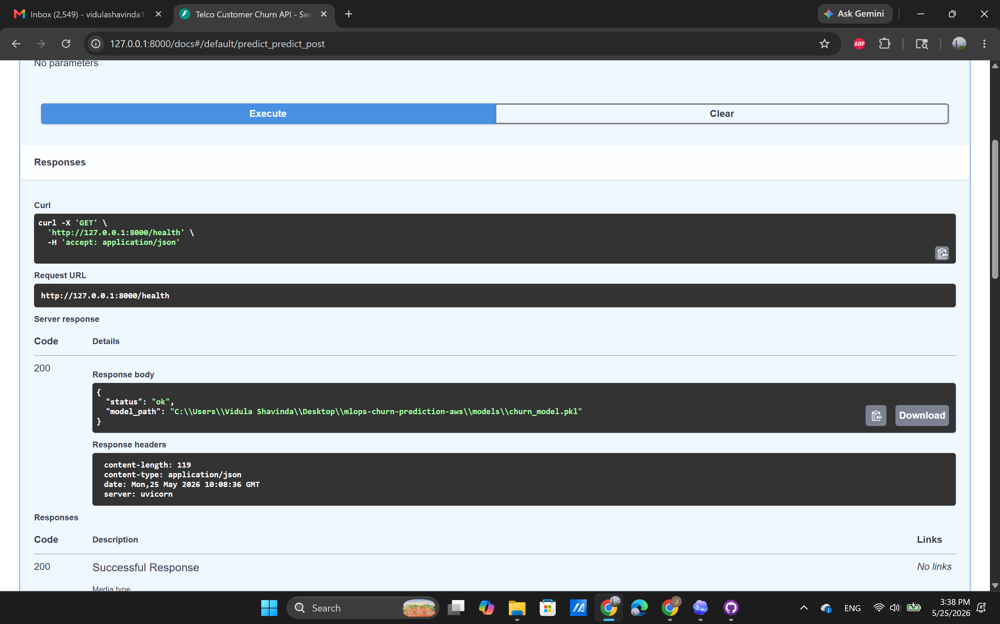
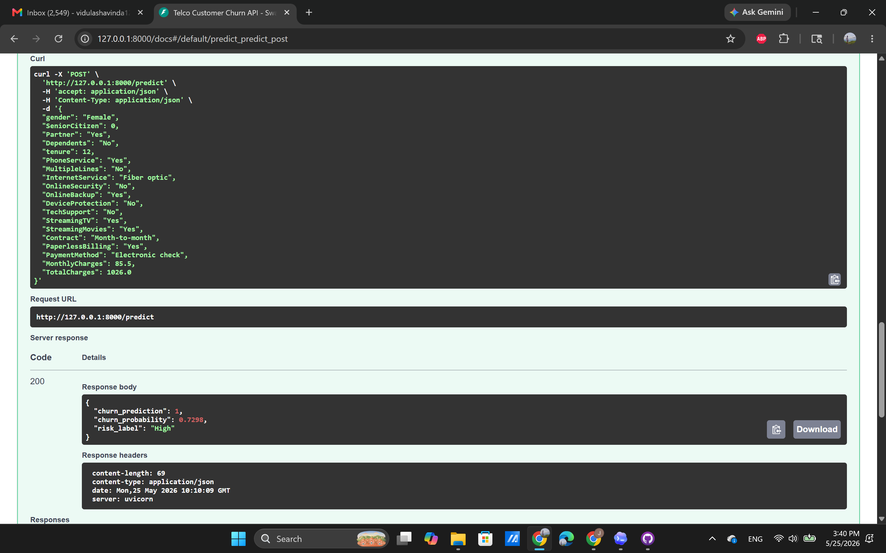
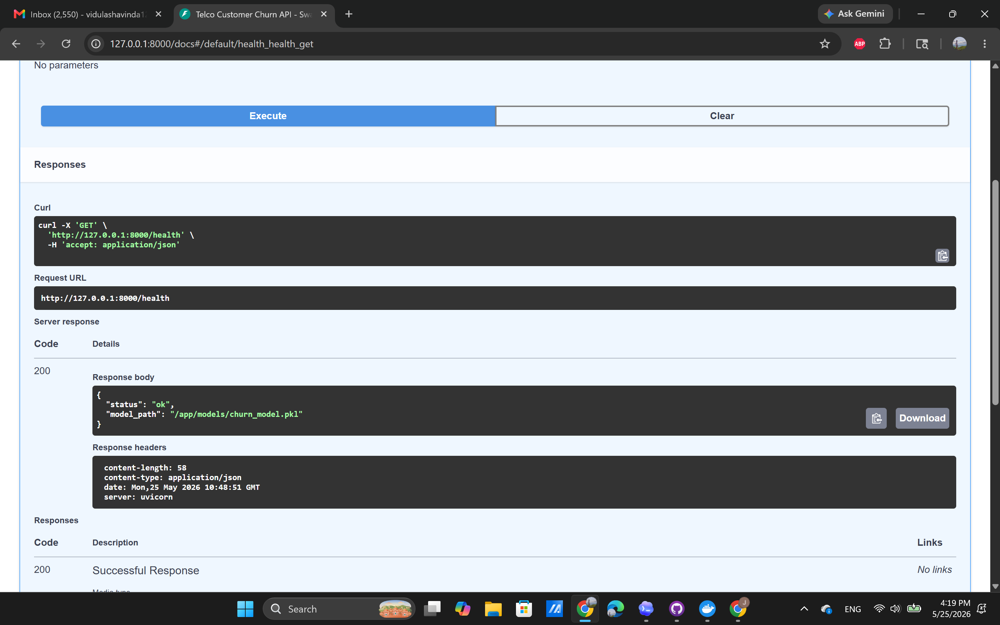
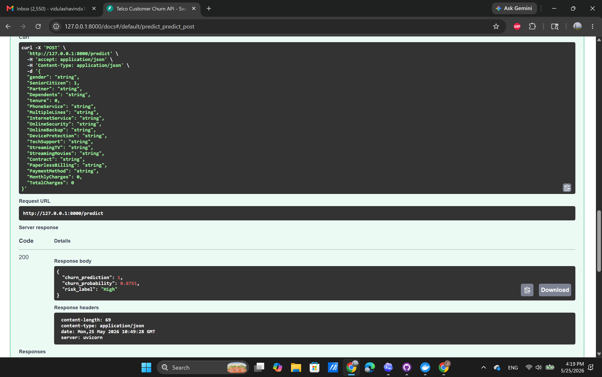

# End-to-End MLOps Pipeline for Customer Churn Prediction on AWS

This project demonstrates an end-to-end MLOps workflow for predicting customer churn using the Telco Customer Churn dataset. It covers data preprocessing, model training, model evaluation, API serving with FastAPI, containerization with Docker, and an AWS deployment plan using Amazon ECR, EC2, and GitHub Actions.

The goal is to present a practical, portfolio-ready machine learning system that can be trained locally, packaged as a production-style API, and deployed to cloud infrastructure through a repeatable CI/CD workflow.

## Project Overview

Customer churn prediction helps subscription-based businesses identify customers who are likely to cancel their service. This project trains and serves a binary classification model that predicts whether a customer is likely to churn based on demographic, account, billing, and service usage attributes.

The trained model is exposed through a FastAPI application with:

- A health-check endpoint for operational monitoring
- A prediction endpoint for real-time churn inference
- Docker support for consistent local and cloud execution
- A GitHub Actions workflow for building, pushing, and deploying the API container

## Business Problem

Customer retention is often more cost-effective than customer acquisition. For telecom providers, early churn detection enables business teams to:

- Identify high-risk customers before they leave
- Prioritize retention campaigns and customer success outreach
- Understand which customer segments are more likely to churn
- Reduce revenue loss caused by preventable cancellations

The model output can support a retention workflow by assigning each customer a churn probability and risk label.

## Dataset Description

This project uses the Telco Customer Churn dataset, which contains 7,043 customer records. Each row represents one customer and includes service, account, and billing information.

Key feature groups:

- Demographics: `gender`, `SeniorCitizen`, `Partner`, `Dependents`
- Account information: `tenure`, `Contract`, `PaperlessBilling`, `PaymentMethod`
- Services: `PhoneService`, `MultipleLines`, `InternetService`, `OnlineSecurity`, `OnlineBackup`, `DeviceProtection`, `TechSupport`, `StreamingTV`, `StreamingMovies`
- Billing: `MonthlyCharges`, `TotalCharges`
- Target variable: `Churn`, with values `Yes` or `No`

Preprocessing steps include:

- Dropping `customerID`
- Converting `TotalCharges` to a numeric field
- Encoding the target variable as `1` for churn and `0` for no churn
- Imputing missing values
- One-hot encoding categorical variables
- Scaling numerical variables
- Stratified train/test split

## Tech Stack

| Area | Tools |
| --- | --- |
| Language | Python 3.11 |
| Data processing | Pandas |
| Machine learning | Scikit-learn |
| Model persistence | Joblib |
| API | FastAPI, Uvicorn, Pydantic |
| Containerization | Docker |
| Cloud registry | Amazon ECR |
| Cloud compute | Amazon EC2 |
| CI/CD | GitHub Actions |

## Folder Structure

```text
.
|-- .github/
|   `-- workflows/
|       `-- deploy.yml
|-- app/
|   `-- main.py
|-- data/
|   `-- raw/
|       `-- telco_churn.csv.csv
|-- models/
|   `-- churn_model.pkl
|-- notebooks/
|   `-- 01_data_inspection.ipynb
|-- reports/
|   `-- metrics.json
|-- screenshots/
|   |-- docker_health_check.png
|   |-- docker_prediction_test.png.png
|   |-- fastapi_health_check.png.png
|   `-- fastapi_prediction_test.png.png
|-- src/
|   |-- preprocess.py
|   `-- train.py
|-- Dockerfile
|-- PROJECT_CONTEXT.md
|-- README.md
`-- requirements.txt
```

## Model Training Results

Two baseline classification models were trained and evaluated using accuracy, precision, recall, F1-score, and ROC-AUC.

| Model | Accuracy | Precision | Recall | F1-Score | ROC-AUC |
| --- | ---: | ---: | ---: | ---: | ---: |
| Logistic Regression | 0.8055 | 0.6572 | 0.5588 | 0.6040 | 0.8419 |
| Random Forest | 0.7821 | 0.6143 | 0.4813 | 0.5397 | 0.8211 |

The best model based on F1-score was **Logistic Regression**.

## Why Logistic Regression Was Selected

Logistic Regression was selected because it provided the strongest overall evaluation results for this baseline pipeline. It achieved higher accuracy, precision, recall, F1-score, and ROC-AUC than the Random Forest model in the current experiment.

It is also a strong choice for a portfolio MLOps project because it is:

- Interpretable and easy to explain to business stakeholders
- Fast to train and lightweight to serve through an API
- Well suited for tabular binary classification problems
- Stable as a baseline model for future experimentation

## FastAPI Endpoint Documentation

Run the API locally with:

```powershell
uvicorn app.main:app --reload --host 0.0.0.0 --port 8000
```

Interactive API documentation is available at:

```text
http://localhost:8000/docs
```

### GET /health

Checks whether the API is running and whether the trained model artifact is available.

Example request:

```powershell
curl http://localhost:8000/health
```

Example response:

```json
{
  "status": "ok",
  "model_path": "C:\\path\\to\\models\\churn_model.pkl"
}
```

If the model file is missing, the `status` field returns `model_missing`.

### POST /predict

Returns a churn prediction, churn probability, and risk label for a single customer.

Example request:

```powershell
curl -X POST http://localhost:8000/predict `
  -H "Content-Type: application/json" `
  -d '{
    "gender": "Female",
    "SeniorCitizen": 0,
    "Partner": "Yes",
    "Dependents": "No",
    "tenure": 12,
    "PhoneService": "Yes",
    "MultipleLines": "No",
    "InternetService": "Fiber optic",
    "OnlineSecurity": "No",
    "OnlineBackup": "Yes",
    "DeviceProtection": "No",
    "TechSupport": "No",
    "StreamingTV": "Yes",
    "StreamingMovies": "Yes",
    "Contract": "Month-to-month",
    "PaperlessBilling": "Yes",
    "PaymentMethod": "Electronic check",
    "MonthlyCharges": 85.5,
    "TotalCharges": 1026.0
  }'
```

Example response:

```json
{
  "churn_prediction": 1,
  "churn_probability": 0.7123,
  "risk_label": "High"
}
```

Response fields:

| Field | Description |
| --- | --- |
| `churn_prediction` | Binary prediction. `1` means likely to churn, `0` means unlikely to churn. |
| `churn_probability` | Predicted probability of churn, rounded to four decimal places. |
| `risk_label` | Business-friendly risk category: `Low`, `Medium`, or `High`. |

## Local Setup

Create and activate a virtual environment:

```powershell
python -m venv .venv
.\.venv\Scripts\Activate.ps1
```

Install dependencies:

```powershell
pip install -r requirements.txt
```

Train the model if `models/churn_model.pkl` is missing:

```powershell
python src\train.py
```

Start the API:

```powershell
uvicorn app.main:app --reload --host 0.0.0.0 --port 8000
```

## Docker Build and Run

Build the Docker image:

```powershell
docker build -t telco-churn-api .
```

Run the Docker container:

```powershell
docker run --rm -p 8000:8000 telco-churn-api
```

Open the API documentation:

```text
http://localhost:8000/docs
```

Test the containerized health endpoint:

```powershell
curl http://localhost:8000/health
```

## Screenshots

The `screenshots/` folder contains evidence of local API and Docker-based testing.

### FastAPI Health Check



### FastAPI Prediction Test



### Docker Health Check



### Docker Prediction Test



## AWS Deployment Plan

The deployment plan uses Amazon ECR as the container registry, Amazon EC2 as the compute environment, and GitHub Actions as the CI/CD automation layer.

### 1. Build and Test Locally

Train the model, run the FastAPI app, and verify `/health` and `/predict` locally.

```powershell
python src\train.py
uvicorn app.main:app --reload --host 0.0.0.0 --port 8000
```

### 2. Create an Amazon ECR Repository

Create a private ECR repository for the API image.

```powershell
aws ecr create-repository `
  --repository-name telco-churn-api `
  --region us-east-1
```

### 3. Build, Tag, and Push the Docker Image

```powershell
$AWS_REGION = "us-east-1"
$AWS_ACCOUNT_ID = "123456789012"
$ECR_REPOSITORY = "telco-churn-api"
$IMAGE_TAG = "latest"
$ECR_URI = "$AWS_ACCOUNT_ID.dkr.ecr.$AWS_REGION.amazonaws.com/$ECR_REPOSITORY"

aws ecr get-login-password --region $AWS_REGION | docker login `
  --username AWS `
  --password-stdin "$AWS_ACCOUNT_ID.dkr.ecr.$AWS_REGION.amazonaws.com"

docker build -t ${ECR_REPOSITORY}:${IMAGE_TAG} .
docker tag ${ECR_REPOSITORY}:${IMAGE_TAG} ${ECR_URI}:${IMAGE_TAG}
docker push ${ECR_URI}:${IMAGE_TAG}
```

### 4. Prepare the EC2 Instance

Launch an EC2 instance, install Docker, and allow inbound traffic on port `8000`.

```bash
sudo yum update -y
sudo yum install -y docker
sudo systemctl start docker
sudo systemctl enable docker
sudo usermod -aG docker ec2-user
```

Reconnect to the instance after adding `ec2-user` to the Docker group.

### 5. Run the API Container on EC2

```bash
aws ecr get-login-password --region us-east-1 | docker login \
  --username AWS \
  --password-stdin 123456789012.dkr.ecr.us-east-1.amazonaws.com

docker pull 123456789012.dkr.ecr.us-east-1.amazonaws.com/telco-churn-api:latest

docker run -d \
  --name telco-churn-api \
  -p 8000:8000 \
  123456789012.dkr.ecr.us-east-1.amazonaws.com/telco-churn-api:latest
```

After deployment, the API can be accessed at:

```text
http://<ec2-public-ip>:8000/docs
```

### 6. Automate Deployment with GitHub Actions

The repository includes `.github/workflows/deploy.yml`, which is designed to:

- Check out the repository
- Configure AWS credentials
- Log in to Amazon ECR
- Build and tag the Docker image
- Push the image to ECR
- SSH into EC2
- Pull and restart the latest container

Required GitHub repository secrets:

| Secret | Purpose |
| --- | --- |
| `AWS_ACCESS_KEY_ID` | IAM access key used by GitHub Actions |
| `AWS_SECRET_ACCESS_KEY` | IAM secret access key used by GitHub Actions |
| `AWS_REGION` | AWS region for ECR and deployment |
| `EC2_HOST` | Public IP address or DNS name of the EC2 instance |
| `EC2_USERNAME` | SSH username, such as `ec2-user` |
| `EC2_SSH_KEY` | Private SSH key used to connect to EC2 |

The workflow currently runs through `workflow_dispatch`, which allows deployment to be triggered manually from the GitHub Actions tab.

## Future Improvements

- Add automated tests for preprocessing, model loading, and API responses
- Track experiments with MLflow or another experiment tracking tool
- Add data and model versioning with DVC or cloud object storage
- Improve model performance with hyperparameter tuning and additional algorithms
- Add feature importance reporting for stakeholder-facing model interpretation
- Add request logging and monitoring for production observability
- Deploy behind a reverse proxy with HTTPS
- Add authentication or API key validation for protected prediction access
- Extend CI/CD to run tests before building and deploying the image
- Consider ECS, App Runner, or SageMaker for more scalable production deployment
